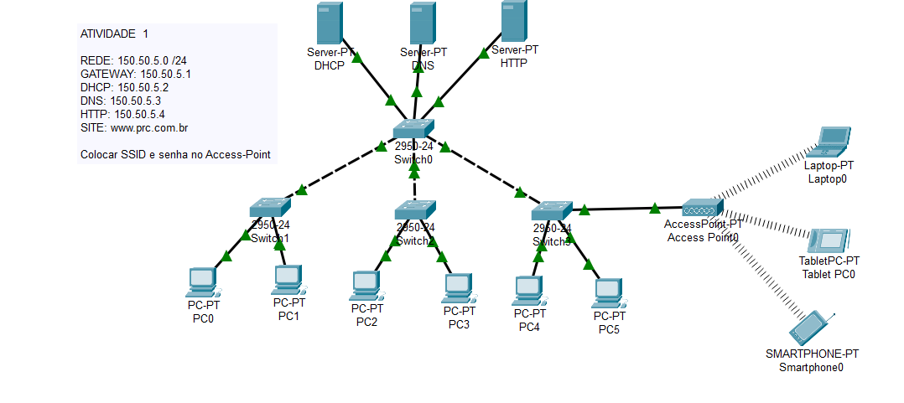

# Configuração de Rede Local com Cisco Packet Tracer

Este projeto apresenta a configuração de uma rede local (LAN) utilizando o Cisco Packet Tracer.  

O Projeto incluiu os seguintes passos:  
- Configuração de gateway, servidores DHCP, DNS e HTTP.  
- Atribuição de endereços IP na rede.  
- Configuração de um Access Point com SSID e senha.  

**Objetivo:** Criar e validar uma infraestrutura de rede funcional para simulação.

### Requisitos
- **Rede:** 150.50.5.0/24  
- **Gateway:** 150.50.5.1  
- **Servidores:**  
  - DHCP: 150.50.5.2  
  - DNS: 150.50.5.3  
  - HTTP: 150.50.5.4  
  - Site hospedado: www.prc.com.br  
- **Configuração de Access Point:** SSID com senha.

### Conteúdo do Repositório
- `local-network-config.pkt`: Arquivo da configuração da rede para o Cisco Packet Tracer.  
- `screenshots/`: Imagens da topologia e configurações realizadas.  
- `README.md`: Documentação do projeto.  

### Como Abrir o Projeto
1. Faça o download do [Cisco Packet Tracer](https://www.netacad.com/pt-br/courses/packet-tracer).  
2. Baixe o arquivo `local-network-config.pkt` neste repositório.  
3. Abra o arquivo diretamente no Cisco Packet Tracer para visualizar e interagir com a rede.  

### Topologia da Rede

### Configuração de DHCP

### Configuração de HTTP

